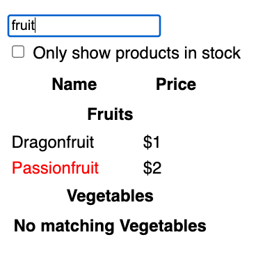

# Adding features in React 

Two different approaches

1. Spike and stabilize
2. Make the change easy, then make the easy change.

We are going to add features to the excellent tutorial [Thinking in React](https://react.dev/learn/thinking-in-react).  Currently, filtering removes both headers and items.  We are not handling the empty state very well.

Our stakeholders want to keep users aware we have fruits and vegetables even when no items match.  

## Spike and stabilize

* [Software, Faster - Dan North](https://youtu.be/USc-yLHXNUg?t=950)
* [Building Features with Spike & Stabilise](https://medium.com/ingeniouslysimple/building-features-with-spike-stabilise-1906a9006a87)

The goal of spike and stabilize  is to get rapid feedback.  During the spike, we are going to prioritize exploration and learning and deemphasize code quality and edge cases.   

