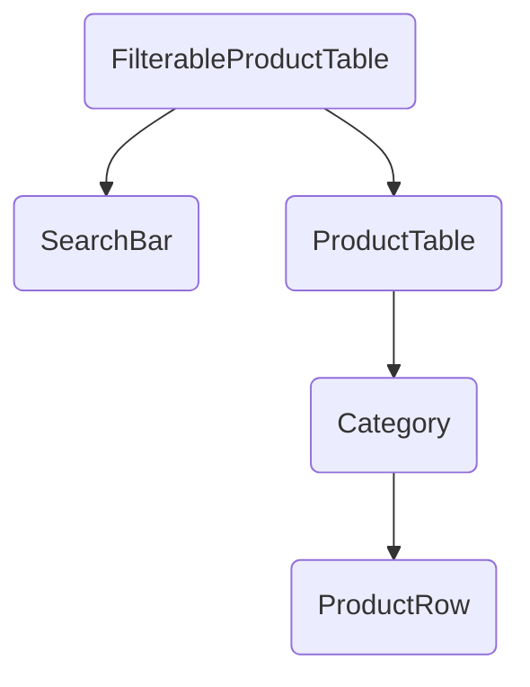

# Influence
[Simple Made East - Rich Hickey](https://www.infoq.com/presentations/Simple-Made-Easy/)
[Value of Values - Rich Hickey](https://www.youtube.com/watch?v=-6BsiVyC1kM)

# Dislikes
1. Overly Complex
2. Largest components get larger
3. Too much logic in component
4. Prop drilling
5. Surface area
6. Failed usability test
   


Transform the data you have into the data you need:

```
{
  Fruits: [
    {price: '$1', stocked: true, name: 'Apple'},
    {price: '$1', stocked: true, name: 'Dragonfruit'},
    {price: '$2', stocked: false, name: 'Passionfruit'},
  ],
  Vegetables: [
    {price: '$2', stocked: true, name: 'Spinach'},
    {price: '$4', stocked: false, name: 'Pumpkin'},
    {price: '$1', stocked: true, name: 'Peas'}
  ]
}
```

#### My Refactor:
```
import { useState } from "react";

const getCategories = (products) =>
  products.reduce((prev, { category }) => ({ ...prev, [category]: [] }), {});
// {Fruits: [], Vegetables: []}

// Point 1: transform data code
const getFilteredProductsByCategory = (products, filterText, isStockOnly) => {
  const lowerCaseFilterText = filterText.toLowerCase();
  const categories = getCategories(products);

  return products
    .filter(
      ({ name }) =>
        !lowerCaseFilterText || name.toLowerCase().includes(lowerCaseFilterText)
    )
    .filter(({ stocked }) => !isStockOnly || stocked)
    .reduce(
      (prev, { category, ...cur }) => ({
        ...prev,
        [category]: [...prev[category], cur],
      }),
      categories
    );
};

// Point 4: better usability, lets do our change here
function Category({ category, products }) {
  const hasProducts = products.length > 0;
  if (!hasProducts) {
    return null;
  }
  return (
    <>
      <tr>
        <th colSpan="2">{category}</th>
      </tr>
      {products.map((row) => (
        <ProductRow key={row.name} product={row} />
      ))}
    </>
  );
}


// Point 2: use code, pass less data
function FilterableProductTable({ products }) {
  const [filterText, setFilterText] = useState("");
  const [inStockOnly, setInStockOnly] = useState(false);
  const filteredProducts = getFilteredProductsByCategory(
    products,
    filterText,
    inStockOnly
  );

  return (
    <div>
      <SearchBar
        filterText={filterText}
        inStockOnly={inStockOnly}
        onFilterTextChange={setFilterText}
        onInStockOnlyChange={setInStockOnly}
      />
      <ProductTable products={filteredProducts} />
    </div>
  );
}

function ProductRow({ product }) {
  const name = product.stocked ? (
    product.name
  ) : (
    <span style={{ color: "red" }}>{product.name}</span>
  );

  return (
    <tr>
      <td>{name}</td>
      <td>{product.price}</td>
    </tr>
  );
}

// Point 3: simple logic free
function ProductTable({ products }) {
  const keys = Object.keys(products);

  return (
    <table>
      <thead>
        <tr>
          <th>Name</th>
          <th>Price</th>
        </tr>
      </thead>
      <tbody>
        {keys.map((key) => (
          <Category key={key} category={key} products={products[key]} />
        ))}
      </tbody>
    </table>
  );
}

function SearchBar({
  filterText,
  inStockOnly,
  onFilterTextChange,
  onInStockOnlyChange,
}) {
  return (
    <form>
      <input
        type="text"
        value={filterText}
        placeholder="Search..."
        onChange={(e) => onFilterTextChange(e.target.value)}
      />
      <label>
        <input
          type="checkbox"
          checked={inStockOnly}
          onChange={(e) => onInStockOnlyChange(e.target.checked)}
        />{" "}
        Only show products in stock
      </label>
    </form>
  );
}

const PRODUCTS = [
  { category: "Fruits", price: "$1", stocked: true, name: "Apple" },
  { category: "Fruits", price: "$1", stocked: true, name: "Dragonfruit" },
  { category: "Fruits", price: "$2", stocked: false, name: "Passionfruit" },
  { category: "Vegetables", price: "$2", stocked: true, name: "Spinach" },
  { category: "Vegetables", price: "$4", stocked: false, name: "Pumpkin" },
  { category: "Vegetables", price: "$1", stocked: true, name: "Peas" },
];

export default function App() {
  return <FilterableProductTable products={PRODUCTS} />;
}

```

New Category change is trivial and obvious
```
function Category({ category, products }) {
  const hasProducts = products.length > 0;
  return (
    <>
      <tr>
        <th colSpan="2">{category}</th>
      </tr>
      {hasProducts ? (
        products.map((row) => <ProductRow key={row.name} product={row} />)
      ) : (
        <tr>
          <th colSpan="2">No matching {category}</th>
        </tr>
      )}
    </>
  );
}
```

More best practices:
https://github.com/afrievalt/best-practices-react/blob/main/ideal.md
