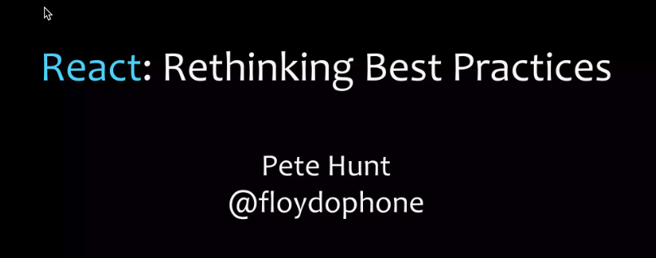
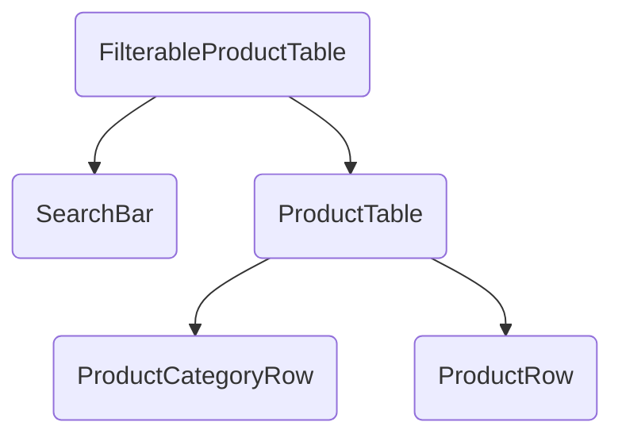

If you don't adjust your thinking, you are going to struggle in react.

# About Me

Andy Frievalt

- 3 decades of frontend software development.
- 8 years of react experience
- ~~Expert~~ A lot of battle scars
- Many experiences where I am confused, then something clicks and NOW i just get it.

# This Talk

Goal of this talk: Share that Click

- compare and contrast past thinking
- go over "Thinking in react" with my interjections
- Do a little Code Kata
- How I would solve it.

To get the most from this, have the docs up to follow along.

# Alt Thinking

## How we thought about frontend dev before react:

#### Separation on concerns before 2015:

- JS
- CSS
- HTML

React is a paradigm shift and combined these technologies.

#### Patterns before 2015 (OOP):

- MVC
- MVP
- MVVM

#### React (functional):

- UI = f(s)  
  OR
- UI = reactFunction(state)

#### opinionated vs unopinionated

- Opinionated: one way to do things - Rails/Java/Angular (opinionated)
- React is unopinionated: No one way to do things => more disagreements

Opinions are mine, if you don't like them, I have others.

#### Client side dominated by jQuery ([Audacity](https://thisdeveloperslife.com/post/1-0-7-audacity))

- Set up event listeners
- Find element(s) in the DOM
- Looping through results to update.
- Poking the dom thinking

**Problems**

- Managing listeners has foot guns similar to manual memory management.
- Slow at scale
- Lowered the bar for development
  - => spaghetti code
  - => Lack of JS fundamentals

# Transitioning to react requires a different type of thinking.

This article makes it click.

## Step 1:

[Atomic Design](https://bradfrost.com/blog/post/atomic-web-design/)


Avoid analysis paralysis



(https://react.dev/learn/understanding-your-ui-as-a-tree)

## Step 2:


```jsx
function ProductTable({ products }) {
  return (
    <table>
      <thead>
        <tr>
          <th>Names</th>
          <th>Price</th>
        </tr>
      </thead>
      <tbody>
        <ProductCategoryRow category="category" />
        <ProductRow product={PRODUCTS[0]} />
        <ProductRow product={PRODUCTS[2]} />
      </tbody>
    </table>
  );
}
```

## Step 3:

- Keep an eye out for derived state.
- Don't think about updating the screen (poking the dom)
- Actions change state
- UI = f(s)
- If it is hard to update state, you likely don't have min state

# Next steps

Test if you got this.


