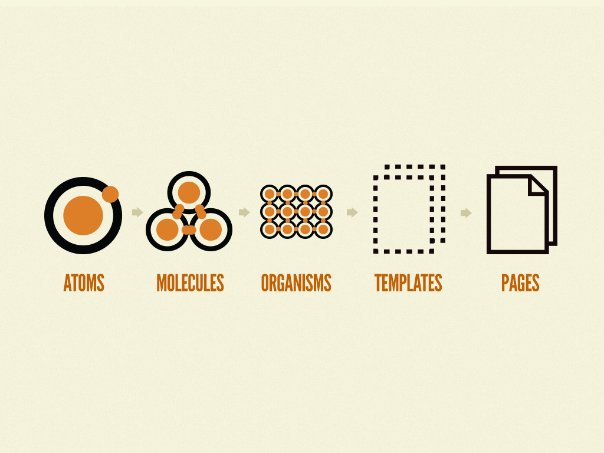
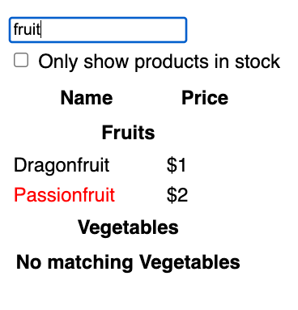

# Alt Thinking
## How we thought about frontend dev before react:

#### Separation on concerns before 2015: 
  * JS
  * CSS
  * HTML

React is a paradime shift and combined these technologies.  

#### Patterns before 2015 (OOP):
  * MVC
  *  MVP
  *  MVVM


#### React (functional):
  * UI = f(s)  
    OR
  * UI = reactFunction(state)

#### Client side dominated by jQuery ([Audacity](https://thisdeveloperslife.com/post/1-0-7-audacity)) 
*  Set up event listeners
*  Find element(s) in the DOM
*  Looping through results to update.
*  Poking the dom thinking

**Problems** 
* Managing listeners has foot guns similar to manual memory management.  
* Slow at scale 
* Lowered the bar for development 
  * => spaghetti code
  * => Lack of JS fundamentals  

# Transitioning to react requires a different type of thinking.
This article makes it click.

## Step 1:
[Atomic Design](https://bradfrost.com/blog/post/atomic-web-design/)

  

Avoid analysis paralysis


(https://react.dev/learn/understanding-your-ui-as-a-tree)

## Step 2:
  


```jsx
function ProductTable({ products }) {
  return (
    <table>
      <thead>
        <tr>
          <th>Names</th>
          <th>Price</th>
        </tr>
      </thead>
      <tbody>
        <ProductCategoryRow category="category"/>
        <ProductRow product={PRODUCTS[0]}/>
        <ProductRow product={PRODUCTS[2]}/>
      </tbody>
    </table>
  );
}
```

## Step 3:
UI = f(s)  

# Next steps 

Test if you got this.

  
